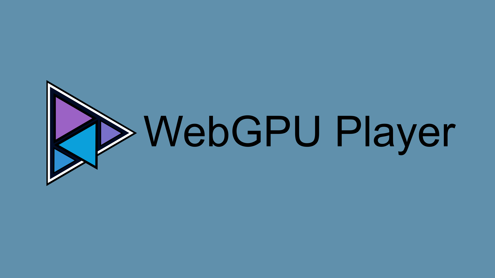

# jellyfin-plugin-webgpu-player



A Jellyfin server plugin that adds the WebGPU Player to an unmodified Jellyfin
Web client. The player is the WebGPU/WebCodecs engine
([alchemyyy/WebGPU-Player](https://github.com/alchemyyy/WebGPU-Player)) plus
its Jellyfin integration from the `alchemyyy/jellyfin-web` fork, repackaged so
that it no longer requires a forked client.

The
[File Transformation](https://github.com/IAmParadox27/jellyfin-plugin-file-transformation)
plugin is optional. When it is installed, the plugin rewrites Jellyfin Web
through it, alongside other plugins that use it. Without it, the plugin's own
middleware does the same rewrites.

The client add-on and its Jellyfin integration are documented in the mdBook in
[docs/](docs/src/SUMMARY.md); the engine has its own book in
`jellyfin-webgpu-client/vendor/webgpu-player/docs/`.

## Design

- **Bootstrap.** Two Jellyfin Web files are rewritten. The same callbacks
  produce the same text on both paths:
  - `index.html` gets one inline script, marked `data-webgpu-player-bootstrap`,
    before the first `</head>`. It sets `window.WebGPUPlayerConfig` (the asset
    base URL) and defines `window.WebGPUPlayer`, a factory that imports the
    add-on entry module. The factory rejects after 20 s, because a factory that
    never settles blocks the client's first render.
  - `config.json` gets `WebGPUPlayer` appended to its `plugins` array. A
    missing or malformed `plugins` is left alone, because a new array would
    replace the client's defaults.
  - Neither file changes when no add-on is embedded.
- **Who rewrites.** At server start an `IHostedService` picks exactly one
  rewriter, so a file is never rewritten twice. The server log names the
  choice.
  - **File Transformation, when installed.** Callbacks are registered on the
    exact keys `index.html` and `config.json`. If File Transformation accepts
    `index.html` but rejects `config.json`, the `index.html` registration is
    withdrawn and the middleware takes over.
  - **The plugin's middleware, otherwise.** It is installed like File
    Transformation's, through an `IStartupFilter`, and stays inert unless
    chosen. It composes with other rewriting middleware:
    - it always calls the next layer;
    - it removes `Accept-Encoding`, conditional and range headers, so inner
      layers return the complete plain file;
    - it issues its own `ETag` and `no-cache`.

    A browser that cached the stock files therefore gets the rewritten ones
    without a hard refresh.
- **Assets.** `<BaseUrl>/WebGPUPlayer/assets/<path>` serves the embedded add-on
  anonymously:
  - `immutable` caching, except `no-cache` for `addon-manifest.json`;
  - `application/wasm` for WASM and `application/octet-stream` for unknown types;
  - precompressed `.br`/`.gz` siblings, when the build provides them;
  - 404 for anything else.

  The route has no `/web/` in it, because File Transformation intercepts every
  such path and only handles text.
- **Client add-on.** The npm package in `jellyfin-webgpu-client/` builds it. A Jellyfin Web
  source tree is a read-only input: host modules resolve from its `src/`, every
  npm package from `jellyfin-webgpu-client/node_modules`, and nothing is written into it.
  - Host singletons are bound late, from the dependency bag.
  - A host-compatible mode stands in for the PlaybackManager seams that stock
    Jellyfin Web does not have.
- **Settings.** The plugin has no server settings. Custom decode and HDR tone
  mapping are per-browser preferences in the player's WebGPU Settings panel,
  stored with the player's other local settings. They shape the device profile
  the server decides on, so a playback keeps the values its negotiation
  adopted, and a change applies from the next playback.

## File Transformation constraints

These apply only while File Transformation does the rewriting.

- It passes Jellyfin's 304 responses through untransformed. A browser that
  cached the stock files before the install needs one hard refresh.
- It runs only one rule list per file. Register the exact keys `index.html`
  and `config.json`, and register them from an `IHostedService`.
- It publishes builds for Jellyfin 10.11, 12.0 and 12.1 only. On 13.0
  development servers, install the 12.1 build by hand.

## Layout

| Path | Purpose |
| --- | --- |
| `Jellyfin.Plugin.WebGPUPlayer/` | Server plugin: project, entry point and service registration |
| `Jellyfin.Plugin.WebGPUPlayer/Transformations/` | The `index.html` and `config.json` rewrites: File Transformation registration and callbacks, the choice of rewriter, and the fallback middleware |
| `Jellyfin.Plugin.WebGPUPlayer/Addon/` | Embedded add-on catalog and the asset route |
| `bin/` | Build output, one folder per project (generated, gitignored): the two .NET projects, and the client add-on in `bin/jellyfin-webgpu-client/` |
| `jellyfin-webgpu-client/` | Client add-on: a private npm package with the add-on sources in `src/` and their webpack, Vitest, ESLint and stylelint configuration |
| `jellyfin-webgpu-client/src/strings/` | The add-on's text: `en-us.json` is the source, and each translation is a `<locale>.json` beside it, written by Weblate |
| `jellyfin-webgpu-client.tests/` | The add-on's Vitest suites, mirroring `jellyfin-webgpu-client/src/`. They import the add-on through `addons/webGPUPlayer/...` and have their own ESLint config, built on the client's |
| `jellyfin-webgpu-client/vendor/webgpu-player/` | Submodule: the engine ([alchemyyy/WebGPU-Player](https://github.com/alchemyyy/WebGPU-Player)), an npm workspace of `jellyfin-webgpu-client/` |
| `jellyfin-webgpu-client/vendor/webgpu-player-hls/` | Submodule: the hls.js fork (`alchemyyy/hls.js`, branch `fix/cals2`) |
| `Jellyfin.Plugin.WebGPUPlayer.Tests/` | xUnit tests |
| `docs/` | The plugin's documentation, an mdBook; `docs/book/` is the built book |
| `images/` | The plugin banner (the source SVG, and the PNG that the package and the repository manifest's `imageUrl` carry), and the plugin logo, the source of the book's favicon |
| `build.sh` | Builds the add-on, embeds it, and builds or publishes the plugin |
| `build.yaml` | Plugin metadata: name, GUID, version and its changelog, `targetAbi`, and the artifacts to package |
| `release.py` | Sets the version, packages the published plugin with a `meta.json` into a plugin repository manifest, and writes the GitHub release notes |
| `manifest.json` | Jellyfin plugin repository manifest, updated by the release workflow |
| `.github/workflows/release.yml` | Release workflow, run by hand with the version to release: builds, packages, and publishes it |

## Requirements

Required:

- bash (Git Bash on Windows) and git.
- The .NET 10 SDK, for the server plugin.
- Node.js 24 or later and npm 11 or later, for the client add-on and the
  engine.
- A Jellyfin Web checkout, used read-only and named by `JELLYFIN_WEB_DIR` or
  `--jellyfin-web-path`. An unmodified upstream checkout works.
- For the engine's WebAssembly decoders, which the first build of a checkout
  compiles: GNU Make, Emscripten 4.0.13 (activated with `emsdk_env` or named by
  `EMSDK`), and rustup. The engine pins Rust 1.96.1 with the
  `wasm32-unknown-unknown` target.
- On Windows, long path support. The engine's decoder build creates paths over
  260 characters, so enable `LongPathsEnabled` and Git's `core.longpaths`. GNU
  Make and the MSVC linker that cargo uses must accept long paths too.

Only for specific tasks:

- uv (or Python 3.10 or later with ruamel.yaml), to set the version and
  package the plugin.
- Python 3.10 or later and the pinned FFmpeg and FFprobe build
  (`2026-03-01-git-862338fe31-full_build-www.gyan.dev`), to generate or check
  the engine's codec vectors.
- MKVToolNix, for the engine's Dolby Vision smoke media scripts.
- mdBook 0.5.4, to build the plugin's and the engine's documentation.
- Chrome, Edge, or Firefox with WebGPU and WebCodecs, over HTTPS or
  `localhost`, and a Jellyfin server, 12.1 or later, to run it. Firefox on
  Windows decodes HEVC in software only, which is below real time at 4K. The
  File Transformation plugin is optional.

## Build

The decoders are build outputs and are not committed; see the engine's
`docs/src/decoders.md`.

`build.sh` does the following:
1. initializes the two submodules (not recursively);
2. builds the engine's decoders with `make -C wasm sources all` when the
   engine's `bin/wasm/` is missing;
3. runs `npm ci` in `jellyfin-webgpu-client/` when `node_modules` is missing;
4. runs `npm run build` there against the Jellyfin Web checkout;
5. builds the plugin, which embeds that build from `bin/jellyfin-webgpu-client/`.

Under Git Bash it passes Windows paths to `node` and `dotnet`. `./build.sh --help`
lists the options.

```sh
# Add-on against ../jellyfin-web, Release build
./build.sh

# Another Jellyfin Web checkout, Debug build
./build.sh --jellyfin-web-path ~/src/jellyfin-web --configuration Debug

# Reuse the existing add-on build in bin/jellyfin-webgpu-client, and dotnet publish instead of dotnet build
./build.sh --skip-npm --publish
```

The add-on build lands in `bin/jellyfin-webgpu-client/`. It first runs the
engine's asset build, which writes the engine's own `bin/`, and copies those
assets into its `libraries/`. The plugin DLL lands
in `bin/Jellyfin.Plugin.WebGPUPlayer/<Configuration>/`, or in `publish/` below
that with `--publish`. `Directory.Build.props` points both .NET projects at the
repository's `bin/`, one folder per project, and drops the target-framework
folder. `obj/` stays in each project.

`.gitattributes` keeps `*.sh` at LF line endings, so bash can run them even
where `core.autocrlf` is set.

### Client add-on

Run these in `jellyfin-webgpu-client/` after `git submodule update --init` and `npm ci`.
`JELLYFIN_WEB_DIR` names the Jellyfin Web checkout, as an absolute path or one
relative to `jellyfin-webgpu-client/`; the default is `../../jellyfin-web`.

| Script | Purpose |
| --- | --- |
| `npm run build` | Production build into the repository's `bin/jellyfin-webgpu-client/`: `addon-manifest.json`, the hashed entry and chunks, and the engine assets in `libraries/` |
| `npm run build:development` | Development build into the repository's `bin/jellyfin-webgpu-client/` |
| `npm test` | The add-on's Vitest suites in `jellyfin-webgpu-client.tests/` |
| `npm run typecheck` | TypeScript check of the add-on, its tests and the engine sources against the host's types |
| `npm run lint`, `npm run stylelint` | ESLint over `jellyfin-webgpu-client/` and `jellyfin-webgpu-client.tests/`; stylelint |
| `npm test -w webgpu-player` | The engine's own suites |

- `scripts/constants.js` names the client's folders: sources, tests, build
  output, and the two submodules. It reads the engine's folders from
  `vendor/webgpu-player/tools/constants.json`. The webpack, Vitest and ESLint
  configs and the build scripts take every path from it, so a moved folder is
  one edit there. `build.sh`, the plugin project, `tsconfig.json`,
  `package.json` and `.gitmodules` still name their paths themselves.
- `build` and `test` first build the hls.js fork when its `dist` is missing
  (`npm ci --ignore-scripts`, then rollup). Delete
  `vendor/webgpu-player-hls/dist` to rebuild it after the submodule moves.
- The build, test, typecheck and lint scripts first write the gitignored
  `tsconfig.host.json`, which maps host module specifiers to
  `JELLYFIN_WEB_DIR`. It also maps the engine's `package.json` imports (such
  as `#wasm/*`), because the client's `node` module resolution does not read
  them. webpack and Vitest read them on their own.
- The typecheck resolves host modules but reports diagnostics only for the
  add-on and engine sources, because the host's own dependencies (React, MUI,
  TanStack Query) are not installed.
- `node_modules/webgpu-player` is npm's workspace junction to
  `vendor/webgpu-player`. Remove it alone (`cmd /c rmdir`) before deleting
  `node_modules` with a tool that follows junctions.

### Plugin

The plugin project embeds `bin/jellyfin-webgpu-client/` directly, so a plain
`dotnet build Jellyfin.Plugin.WebGPUPlayer.slnx` always embeds the current
client build. Without one the build stops with error `WGP0001`, which says how
to build the client, because the plugin does nothing without the add-on.

The project records its embedded file list as a compile input. An add-on build
that only lost files therefore still triggers a rebuild, and removed files never
stay embedded. Packaging tools that only run `dotnet` need the add-on built
first, either with `build.sh` or with `npm run build` in `jellyfin-webgpu-client/`.

`dotnet test Jellyfin.Plugin.WebGPUPlayer.slnx` runs the tests. The per-file
asset route test runs only when an add-on is embedded.

The plugin targets net10.0 against `Jellyfin.Controller` 12.1.0, with
`targetAbi` 12.1.0.0.

## Localization

The add-on's text is translated the way Jellyfin Web's is: one JSON file per
language with a key for every string, maintained through Weblate.

- `jellyfin-webgpu-client/src/strings/en-us.json` is the source and the
  fallback. Each translation is a `<locale>.json` beside it, named by the
  lowercase BCP 47 tag of a Jellyfin Web display language, such as `de.json` or
  `pt-br.json`. A new file needs no code change: the build makes every file in
  the folder its own lazy chunk.
- The add-on loads the translation for Jellyfin Web's display language, else
  the one for its base language (`pt` for `pt-br`). A string that is missing or
  empty there shows its `en-us.json` text.
- Keys start with `WebGPU`. Words Jellyfin Web already translates, such as
  `Default`, `Auto`, `Unknown` and `ButtonClose`, use Jellyfin Web's own keys
  and translations.
- `{0}`, `{1}` are placeholders, as in Jellyfin Web. A translation keeps them
  and may reorder them. `WebGPUJoinedSentences` (`{0} {1}`) joins two complete
  sentences, so a language can change the separator.
- Names of technologies, standards and algorithms are not translated: WebGPU,
  HTML, WebCodecs, ACES, Reinhard, AC-4, RFC 7845 and Dave750.
- `jellyfin-webgpu-client.tests/strings/strings.test.ts` checks the folder: the
  file names, that a translation has only source keys and keeps their
  placeholders, that every key the add-on translates exists, and that no source
  key is unused.

The Weblate component:

| Setting | Value |
| --- | --- |
| File format | JSON file |
| File mask | `jellyfin-webgpu-client/src/strings/*.json` |
| Monolingual base language file | `jellyfin-webgpu-client/src/strings/en-us.json` |
| Language code style | BCP style using hyphen as a separator, lower cased |
| Source language | English |

Nothing else needs translating. The server plugin shows no text of its own, and
Jellyfin does not translate plugin names or descriptions. The engine renders no
text either: the add-on translates the codes it reports.

## Install

Add
`https://raw.githubusercontent.com/alchemyyy/jellyfin-plugin-webgpu-player/main/manifest.json`
as a plugin repository in Jellyfin (Dashboard > Plugins), install WebGPU Player
from the catalog, and restart the server.

## Release

Run the Release workflow on `main` from the Actions tab (Release > Run
workflow), or with the GitHub CLI:

```sh
gh workflow run release.yml --ref main -f version=1.1.0.0 -f changelog="Add HDR10+ tone mapping"
```

`version` is required: four parts without a leading `v`. `changelog` is
optional, one line, and defaults to `Release X.X.X.X`.
`.github/workflows/release.yml` then:
1. stops unless it runs on `main`, or if the tag `vX.X.X.X` exists;
2. runs `release.py set-version`, which writes the version into `build.yaml`
   and `Directory.Build.props` and the changelog into `build.yaml`;
3. installs Node.js 24, .NET 10, uv, the Emscripten version the engine's
   `wasm/Makefile` pins, and the Rust toolchain of the Dolby Vision crate;
4. checks out Jellyfin Web at the upstream commit `JELLYFIN_WEB_REF` names, and
   runs `./build.sh --publish` against it;
5. writes the corresponding source of the LGPL decoders with
   `make -C wasm source-archives`;
6. packages the plugin into `manifest.json`, with the release asset as its
   `sourceUrl`, and runs `release.py release-notes`, which writes the release
   body: the changelog when given, the install steps, the merged pull requests,
   and the commits since the previous `v` tag, without the release commits;
7. commits `build.yaml`, `Directory.Build.props` and `manifest.json` as
   `Release X.X.X.X`, tags it, and publishes the GitHub release with the zip
   and the source tarballs;
8. rebases that commit onto `main` and pushes it, so `manifest.json` names a zip
   only once its release exists.

- The workflow pushes to `main` with `GITHUB_TOKEN`, so `main` must not
  require pull requests.
- A failure before step 7 publishes nothing. Fix it and run the workflow again
  with the same version.
- `JELLYFIN_WEB_REF` pins the Jellyfin Web source tree of release builds.
  Move it with the checkout the add-on is developed against.

### Test install from a local build

```sh
./build.sh --publish
uv run release.py package
python -m http.server --directory bin/package
```

`release.py package` writes `bin/package/webgpu-player_<version>.zip`, holding
the DLL and `meta.json`, and records that version in
`bin/package/manifest.json` with the zip's MD5, keeping other versions newest
first.
- A server on the same machine takes
  `http://localhost:8000/manifest.json` as a repository. For another machine,
  package with `--source-url-base http://<host>:8000` and use that host.
- The server downloads over HTTP(S) only and rejects a zip whose MD5 differs
  from the manifest's `checksum`, so package again after every build.
- The version and changelog come from `build.yaml`, and the three version
  properties in `Directory.Build.props` must match it.
  `uv run release.py set-version <version> --changelog <text>` sets both
  files.
