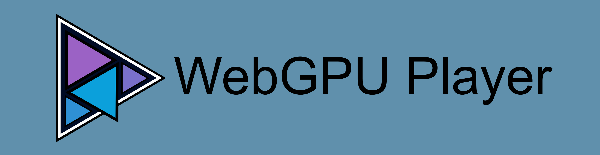

<h1 align="center">
  Jellyfin WebGPU Player<br>
  <sub><sup><sup>A WebGPU-based player plugin for Jellyfin Web</sup></sup></sub>
</h1>

<p align="center">
  
</p>

## About

<p align="center"><b><i>This plugin is in alpha!!!</i></b></p>

This plugin adds a custom WebGPU-based media player as an optional player backend to Jellyfin in the browser. This allows (theoretically) any media to be played directly in the client's browser, which would otherwise need to be transcoded on the server. This includes HDR->SDR tone-mapping, and multichannel audio downmixing. This player also links to software implementations of popular codecs which some devices don't support natively.

Benefits of this, beyond massive performance, are total control over tone-mapping and audio downmixing settings on a per-device basis.

## Installation

Add this plugin as you would any other plugin: add this manifest to your plugin repositories, then install the "WebGPU Player" plugin from it:
```
https://raw.githubusercontent.com/alchemyyy/jellyfin-plugin-webgpu-player/refs/heads/main/manifest.json
```

The [File Transformation](https://github.com/IAmParadox27/jellyfin-plugin-file-transformation) plugin is optional. When it is installed, the plugin rewrites Jellyfin Web through it, alongside other plugins that use it. Without it, the plugin's own middleware does the same rewrites.

The plugin itself is basically a wrapper for injecting modifications into the Jellyfin Web client. The web client modifications live in [jellyfin-webgpu-client](https://github.com/alchemyyy/jellyfin-plugin-webgpu-player/tree/main/jellyfin-webgpu-client). The player backend itself is its own project here: [WebGPU-Player](https://github.com/alchemyyy/WebGPU-Player). This plugin also ships with [my own flavor of hls.js for now](https://github.com/alchemyyy/hls.js).

***WARNING:*** This plugin essentially overwrites the stock player, even though it allows access to the old backend. This means there most likely will be compatibility issues between this and other things that modify the player UX. Feel free to report any of these issues and I'll look into fixing them.

## Development

### Documentation

In an effort to be able to continually tackle issues in this project and iterate on it, I'm going back and forth with Claude on a comprehensive set of docs for the plugin and underlying player. These are still a huge WIP since I have to go through and manually clean everything up, but today they're still very useful for crash-coursing an AI agent through the project.

The plugin's docs are an mdBook in [docs/](docs/src/SUMMARY.md), covering the client add-on and its Jellyfin integration. The engine has its own book in `jellyfin-webgpu-client/vendor/webgpu-player/docs/`.

### Contributing and AI Usage

This plugin is practically vibe-coded, so feel free to not use it on that basis. Given this, however, I welcome any and all issues and contributions that are at least 0.1% human-contributed.

#### Issues

I will automatically close any issue that appears to be completely AI-driven and/or auto-submitted. Using AI to help convey the bulk content though is completely fine.

#### PRs

I will automatically do whatever I want with any PR that appears completely AI-driven. I expect to see human-generated reasoning in PR bodies. ***This applies especially to feature PRs***.

I welcome anyone who wants to have their LLM chew on additional codec or device support.

Please oh please have your LLM generate and run tests on what it produces. This isn't a perfect solution, but tests are free and I don't mind letting them pile up since it'll all get cycled around and cleaned up from LLM to LLM anyway.

### Dev Environment Requirements

- bash (Git Bash on Windows) and git.
- The .NET 10 SDK, for the server plugin.
- Node.js 24 or later and npm 11 or later, for the client add-on and the engine.
- For the engine's WebAssembly decoders, which the first build of a checkout compiles: GNU Make, Emscripten 4.0.13 (activated with `emsdk_env` or named by `EMSDK`), and rustup. The engine pins Rust 1.96.1 with the `wasm32-unknown-unknown` target.
- On Windows, long path support. The engine's decoder build creates paths over 260 characters, so enable `LongPathsEnabled` and Git's `core.longpaths`. GNU Make and the MSVC linker that cargo uses must accept long paths too.

Only for specific tasks:

- uv (or Python 3.10 or later with ruamel.yaml), to set the version and package the plugin.
- Python 3.10 or later and the pinned FFmpeg and FFprobe build (`2026-03-01-git-862338fe31-full_build-www.gyan.dev`), to generate or check the engine's codec vectors.
- MKVToolNix, for the engine's Dolby Vision smoke media scripts.
- mdBook 0.5.4, to build the plugin's and the engine's documentation.
- Chrome, Edge, or Firefox with WebGPU and WebCodecs, over HTTPS or `localhost`, and a Jellyfin server, 12.1 or later, to run it. Firefox on Windows decodes HEVC in software only, which is below real time at 4K. The File Transformation plugin is optional.

### Building from Source

```sh
git clone https://github.com/alchemyyy/jellyfin-plugin-webgpu-player.git
cd jellyfin-plugin-webgpu-player
./build.sh
```

`build.sh` initializes the submodules, builds the client add-on, embeds it, and builds the plugin. `./build.sh --help` lists its options.

- Jellyfin Web is a shallow submodule pinned to the commit the add-on builds against, and is only read. `--jellyfin-web-path` builds against another checkout.
- The first build of a checkout also compiles the engine's WebAssembly decoders, in the background while the add-on's npm build runs.
- `--publish` runs `dotnet publish` instead of `dotnet build`, for packaging.
- The add-on's own checks run from `jellyfin-webgpu-client/`: `npm run typecheck`, `npm run lint`, `npm test`, and `npm run build`.

### Test Install

```sh
./build.sh --publish
uv run .github/scripts/release.py package
python -m http.server --directory bin/package
```

Add `http://localhost:8000/manifest.json` as a plugin repository, then install the plugin from it.

- For a server on another machine, package with `--source-url-base http://<host>:8000` and use that host.
- The server rejects a zip whose MD5 differs from the manifest's `checksum`, so package again after every build.

### Project Map

| Path | Purpose |
| --- | --- |
| `Jellyfin.Plugin.WebGPUPlayer/` | Server plugin: project, entry point and service registration |
| `Jellyfin.Plugin.WebGPUPlayer/Transformations/` | The `index.html` and `config.json` rewrites: File Transformation registration and callbacks, the choice of rewriter, and the fallback middleware |
| `Jellyfin.Plugin.WebGPUPlayer/Addon/` | Embedded add-on catalog and the asset route |
| `bin/` | Build output, one folder per project (generated, gitignored): the two .NET projects, and the client add-on in `bin/jellyfin-webgpu-client/` |
| `jellyfin-webgpu-client/` | Client add-on: a private npm package with the add-on sources in `src/` and their webpack, Vitest, ESLint and stylelint configuration |
| `jellyfin-webgpu-client/src/strings/` | The add-on's text: `en-us.json` is the source, and each translation is a `<locale>.json` beside it, written by Weblate |
| `jellyfin-webgpu-client.tests/` | The add-on's Vitest suites, mirroring `jellyfin-webgpu-client/src/`. They import the add-on through `addons/webGPUPlayer/...` and have their own ESLint config, built on the client's |
| `jellyfin-webgpu-client/vendor/webgpu-player/` | Submodule: the engine ([alchemyyy/WebGPU-Player](https://github.com/alchemyyy/WebGPU-Player)), an npm workspace of `jellyfin-webgpu-client/` |
| `jellyfin-webgpu-client/vendor/webgpu-player-hls/` | Submodule: the hls.js fork (`alchemyyy/hls.js`, branch `fix/cals2`) |
| `jellyfin-webgpu-client/vendor/jellyfin-web/` | Shallow submodule: the Jellyfin Web commit the add-on builds against, read-only |
| `Jellyfin.Plugin.WebGPUPlayer.Tests/` | xUnit tests |
| `docs/` | The plugin's documentation, an mdBook; `docs/book/` is the built book |
| `images/` | The plugin banner (the source SVG, and the PNG that the package carries and the repository manifest's `imageUrl` names on `main`), and the plugin logo, the source of the book's favicon |
| `build.sh` | Builds the add-on, embeds it, and builds or publishes the plugin |
| `build.yaml` | Plugin metadata: name, GUID, version and its changelog, `targetAbi`, and the artifacts to package |
| `.github/scripts/release.py` | Sets the version, packages the published plugin with a `meta.json` into a plugin repository manifest, and writes the GitHub release notes |
| `manifest.json` | Jellyfin plugin repository manifest, updated by the release workflow |
| `.github/workflows/release.yml` | Release workflow, run by hand with the version to release: builds, packages, and publishes it |

### Localization

The add-on's text is translated the way Jellyfin Web's is: one JSON file per language with a key for every string, maintained through Weblate.

- `jellyfin-webgpu-client/src/strings/en-us.json` is the source and the fallback. Each translation is a `<locale>.json` beside it.
- The add-on loads the translation for Jellyfin Web's display language, else the one for its base language (`pt` for `pt-br`). A string that is missing or empty there shows its `en-us.json` text.
- Keys start with `WebGPU`. Words Jellyfin Web already translates, such as `Default`, `Auto`, `Unknown` and `ButtonClose`, use Jellyfin Web's own keys and translations.
- `{0}`, `{1}` are placeholders, as in Jellyfin Web. A translation keeps them and may reorder them. `WebGPUJoinedSentences` (`{0} {1}`) joins two complete sentences, so a language can change the separator.
- Names of technologies, standards and algorithms are not translated: WebGPU, HTML, WebCodecs, ACES, Reinhard, AC-4, RFC 7845 and Dave750.
- `jellyfin-webgpu-client.tests/strings/strings.test.ts` checks the folder: the file names, that a translation has only source keys and keeps their placeholders, that every key the add-on translates exists, and that no source key is unused.

The Weblate component:

| Setting | Value |
| --- | --- |
| File format | JSON file |
| File mask | `jellyfin-webgpu-client/src/strings/*.json` |
| Monolingual base language file | `jellyfin-webgpu-client/src/strings/en-us.json` |
| Language code style | BCP style using hyphen as a separator, lower cased |
| Source language | English |

Nothing else needs translating. The server plugin shows no text of its own, and Jellyfin does not translate plugin names or descriptions. The engine renders no text either: the add-on translates the codes it reports.
