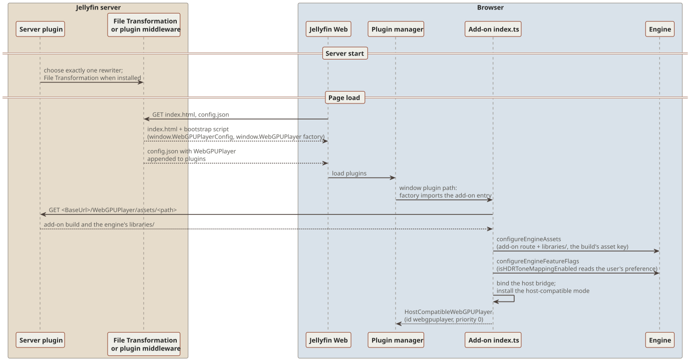
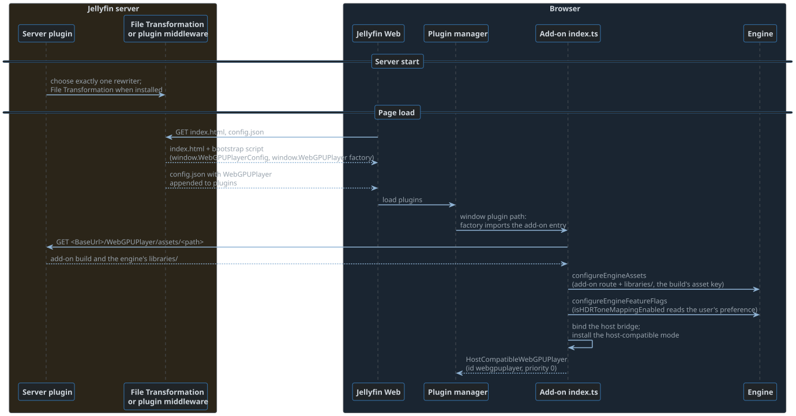

# The client add-on

The add-on is the part of the plugin that runs in Jellyfin Web.
It wraps the engine in a Jellyfin player and supplies the device profile, the settings, and the HTML fallback.

| Path | Holds |
| --- | --- |
| `Jellyfin.Plugin.WebGPUPlayer/` | The server plugin: the web client rewrites and the asset route |
| `jellyfin-webgpu-client/` | The add-on, a private npm package with its sources in `src/` |
| `jellyfin-webgpu-client/vendor/webgpu-player/` | The engine: a submodule, and an npm workspace of the add-on |
| `jellyfin-webgpu-client/vendor/webgpu-player-hls/` | The hls.js fork, a submodule |
| `jellyfin-webgpu-client.tests/` | The add-on's Vitest suites, mirroring its `src/` |
| `bin/jellyfin-webgpu-client/` | The add-on build, which the plugin embeds |
| `docs/` | This book |

## How the add-on reaches the page

<div class="diagram">
<a class="diagram-light" href="diagrams/add-on-bootstrap.light.svg"></a>
<a class="diagram-dark" href="diagrams/add-on-bootstrap.dark.svg"></a>
</div>

1. The server plugin rewrites two Jellyfin Web files, through the File Transformation plugin when it is installed and through its own middleware otherwise.
   `index.html` gets a bootstrap script that sets `window.WebGPUPlayerConfig` (the asset base URL) and defines `window.WebGPUPlayer`, a factory that imports the add-on entry.
   `config.json` gets `WebGPUPlayer` appended to its `plugins` list.
2. Jellyfin Web's plugin manager loads `WebGPUPlayer` through its window plugin path and constructs it with its dependency bag.
3. `jellyfin-webgpu-client/src/index.ts` configures the engine: the asset base is the add-on route plus `libraries/`, the cache key is the engine build's asset key, and `isHDRToneMappingEnabled` reads the user's preference.
   It then binds the host bridge, installs the host-compatible mode, and returns a `HostCompatibleWebGPUPlayer`.
4. The plugin serves the add-on build at `<BaseUrl>/WebGPUPlayer/assets/<path>`, the engine's served folder included.

## The player

`WebGPUPlayer` (`jellyfin-webgpu-client/src/WebGPUPlayer.ts`) is the player PlaybackManager sees: id `webgpuplayer`, priority 0, and `syncPlayWrapAs = 'htmlvideoplayer'`.
It owns an HTML player, the add-on's own copy in `src/backend/htmlVideoPlayer/`, which is both the HTML backend and the event and UI shell of the custom path.
[Playback in Jellyfin Web](playback.md) and [Negotiation](negotiation.md) follow a session through it.

## Host-compatible mode

The player relies on PlaybackManager seams that stock Jellyfin Web does not have.
The add-on supplies each one itself:

| Missing seam | Stand-in |
| --- | --- |
| Bitrate-free selection, the stream-copy veto, and the second request that sizes a transcode | `compat/PlaybackInfoInterceptor.ts`, an interceptor on the server's axios instance, applying `PlaybackInfoPolicy.ts`, `PlaybackBitratePolicy.ts`, and `PlaybackStreamCopyPolicy.ts`. `MediaSourceSelection.ts` replicates PlaybackManager's choice of source |
| Request generations and superseded starts | `compat/PlaybackManagerHooks.ts` wraps `play`, `nextTrack`, `previousTrack`, `setCurrentPlaylistItem`, and `stop` to cancel a pending WebGPU start. A `play` whose options match the pending request's, comparing items by ID, instead returns that request's promise while its start is pending, so a second click does not restart it. `HostCompatibleWebGPUPlayer.play` never settles a superseded start, and stops the server encodings it requested |
| Player preference ordering | `HostCompatibleWebGPUPlayer.canPlayItem` declines when the user prefers the HTML player, and inside a native app shell |
| The player settings menu and the preference control | `compat/SettingsEntryPoints.ts` adds the "WebGPU Settings" button to the player's OSD and the preferred player control to the Playback settings page, through the DOM |
| A listener for source renegotiation | None: the player raises `PlayerEvent.Error`, and PlaybackManager's error retry ladder asks for a transcode |

`src/host/` binds the host's singletons from the plugin bag at construction, so evaluating the add-on's modules never touches them.
`src/shims/` replaces host modules the add-on cannot import directly.

## Settings

Every setting is local to the browser profile.

- `WebGPUUserSettings.ts` stores render controls, the automatic peak, downmix, the output device, and the playback preferences in localStorage under `<userId>-webGPUPlaybackSettings` (version 2).
- Custom decode and HDR tone mapping (`WebGPUPlaybackPreferences.ts`) default to on.
  They shape the device profile, so a playback keeps the values its negotiation adopted, and a change applies from the next negotiation.
- The player preference (Auto, WebGPU, or HTML) is the user setting `preferredVideoPlayer`, stored as `<userId>-preferredVideoPlayer`.

## Build and check

You need Node.js 24 and npm 11, the engine's decoder toolchain from its [Set up a checkout](../../jellyfin-webgpu-client/vendor/webgpu-player/docs/book/setup.html) chapter, and a Jellyfin Web checkout.
The checkout is a read-only input; an unmodified upstream one works.
The server plugin also needs the .NET 10 SDK.

1. In the plugin root, run `git submodule update --init`.
   Then run `npm ci` in `jellyfin-webgpu-client/`.
2. Point `JELLYFIN_WEB_DIR` at the Jellyfin Web checkout, as an absolute path or one relative to `jellyfin-webgpu-client/`.
   The default is `../../jellyfin-web`.
3. In `jellyfin-webgpu-client/`, run:

   ```sh
   npm run typecheck
   npm run lint
   npm test
   npm run build
   ```

What they do:

- Every script first writes the ignored `tsconfig.host.json`, which maps the host's module specifiers into `JELLYFIN_WEB_DIR` and the engine's `imports` into `paths`, because the add-on's `node` module resolution does not read them.
- `typecheck` checks the add-on, its tests, and the engine sources against the host's types.
  It reports only the add-on's and the engine's diagnostics, because the host's own dependencies are not installed.
- `lint` runs ESLint once over the add-on and its tests, on worker threads (`--concurrency=auto`), through the plugin root's `eslint.config.mjs`, which applies each directory's own config below it.
  The engine lints itself, with `npm run lint` in `vendor/webgpu-player/`.
- `test` runs the add-on's suites; `npm test -w webgpu-player` runs the engine's.
- `build` builds the hls.js fork's `dist/hls.js`, the one bundle the add-on imports, when it is missing, runs the engine's asset build, copies `bin/libraries/` (engine) into the add-on's `libraries/`, and writes the add-on to `bin/jellyfin-webgpu-client/`.
- `./build.sh` in the plugin root builds the decoders (when `bin/wasm/` (engine) is missing), the add-on, and the plugin that embeds it.
  Only the asset build reads the decoders, so they build in the background while `npm ci` and the hls.js fork build run.

Engine changes must also pass the engine's own checks, from its root.

## Gotchas

- Never write into the Jellyfin Web checkout.
- `node_modules/webgpu-player` is npm's workspace junction to `vendor/webgpu-player`.
  Remove it alone (`cmd /c rmdir`) before deleting `node_modules` with a tool that follows junctions, or the engine checkout is deleted with it.
- After the hls.js submodule moves, delete `vendor/webgpu-player-hls/dist`; the build rebuilds it only when it is missing.
- The external playback tester, which is in neither repository, parses the `getStats()` labels `Playback pipeline`, `Decoded / presented frames`, and `Dropped / queued frames`.
  They come from the `WebGPUStats*` strings in `jellyfin-webgpu-client/src/strings/en-us.json`, so renaming them, or running a translated UI, breaks its playback proof.
  `Dropped / queued frames` counts the frames the session skipped and the stale frames the controller discarded; late frames, the worst lag, and clock resets have rows of their own.
- File Transformation passes Jellyfin's 304 responses through untransformed, so a browser that cached the stock files before the install needs one hard refresh.
