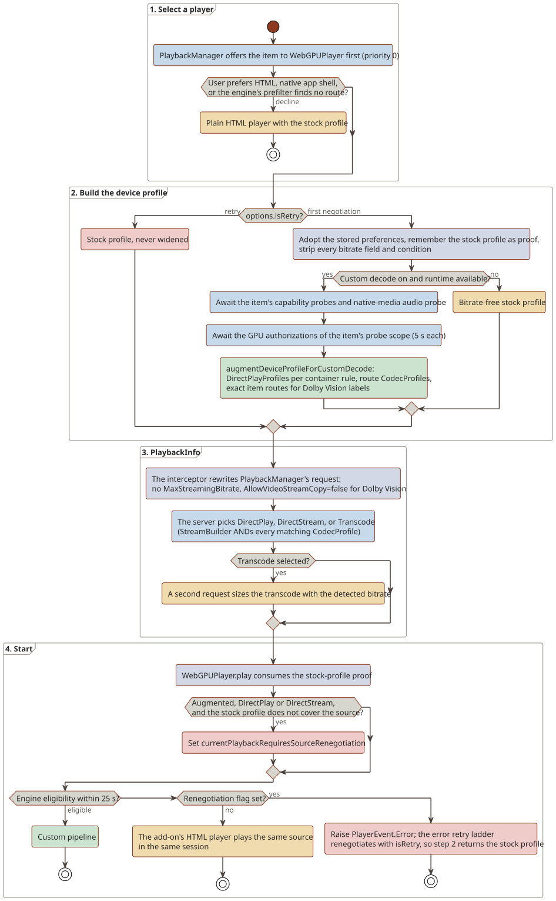
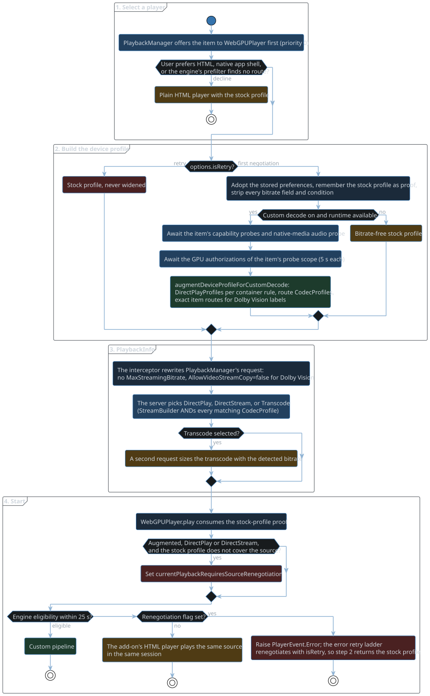

# Negotiation

This chapter follows a playback from player selection to a Jellyfin decision.
Player selection, the device profile, and the PlaybackInfo requests are add-on code.
Eligibility, the probes, and the route catalog are engine code, in the engine's [Eligibility and routes](https://alchemyyy.github.io/WebGPU-Player/routes.html) chapter.
The stock profile is the one the add-on's HTML backend returns from `getDeviceProfile`.

## Flow

1. Select a player.
   PlaybackManager offers the item to players in priority order, and `WebGPUPlayer` (priority 0) comes first.
   `HostCompatibleWebGPUPlayer.canPlayItem` declines when the user prefers the HTML player or inside a native app shell.
   With custom decode enabled, `WebGPUPlayer.canPlayItem` also requires the engine's metadata-only prefilter, `hasPotentialCustomPlaybackVideoRoute`.
   When it declines, PlaybackManager picks the plain HTML player, which negotiates with the stock profile.
2. Build the device profile, in `WebGPUPlayer.getDeviceProfile(item, options)`:
   - A retry (`options.isRetry === true`) returns the stock profile unchanged.
   - Otherwise it adopts the stored playback preferences, keeps the stock profile as a per-item proof (`rememberNativeDeviceProfile`), and strips every bitrate field and condition (`createBitrateIndependentDeviceProfile`).
   - It stops there when custom decode is off or the engine's `getCustomPlaybackRuntimeAvailability` fails (secure context, Worker, `navigator.gpu`, `VideoFrame`).
   - It awaits the engine's `probeCustomDecodeCapabilities(item)` and the native-media audio probe.
     PlaybackInfo waits until the probes the item selects settle; a probe an earlier item ran is not repeated.
   - `getHDRDeviceProfileOptions` waits for the GPU authorizations the item's HDR scope needs (5 s each; see [Probe scopes](#probe-scopes)) and returns the flags and route keys.
   - `CustomDeviceProfile.augmentDeviceProfileForCustomDecode` builds the profile, and `HostCompatibleWebGPUPlayer` marks it so the PlaybackInfo interceptor recognizes the request.
3. Request PlaybackInfo.
   The add-on's axios interceptor (`compat/PlaybackInfoInterceptor.ts`) applies the player's request rules (`compat/PlaybackInfoPolicy.ts`) to the body that stock PlaybackManager built:
   - The selection request carries no `MaxStreamingBitrate`.
   - `AllowVideoStreamCopy` becomes false when `WebGPUPlayer.supportsVideoStreamCopy` vetoes the source, which it does for any Dolby Vision descriptor.
   - When the selected source will transcode, a second request sizes the transcode with the detected bitrate.
4. Start the session.
   `WebGPUPlayer.play` consumes the stock-profile proof.
   It sets `currentPlaybackRequiresSourceRenegotiation` when the profile was augmented, the method is DirectPlay or DirectStream, and `NativeDirectPlayCompatibility.isSameSessionNativePlaybackCompatible` fails for the stock profile.
5. Check eligibility.
   `startCustomPlaybackBounded` (25 s) calls the engine's `getCustomPlaybackEligibility` with the route flags and authorized keys the profile adopted.
   Every HDR and Dolby Vision flag also requires the user's HDR tone mapping setting, and `allowRawSDR` needs only a settled `:sdr` raw key.
6. Fall back.
   An ineligible, timed-out, or failed start falls back.
   Without the renegotiation flag, the add-on's HTML player plays the same source in the same session.
   With it, the player asks for a renegotiation.
   On stock Jellyfin Web that is the error retry ladder, whose `changeStream` passes `isRetry`, so the retry negotiates with the stock profile and is never widened.
   An ineligible start logs its eligibility reason with `console.warn` first, since it raises no error of its own.

## How the profile is augmented

`augmentDeviceProfileForCustomDecode`, in order:

1. Strip bitrate.
2. Find the supported video and audio codecs.
3. Add one DirectPlayProfile per rule in the engine's `CUSTOM_CONTAINER_CODEC_RULES`.
4. Add the custom subtitle profiles (vtt, ass/ssa, pgssub).
5. Scope the stock video and container conditions to non-custom containers.
6. `widenAuthorizedHDRCodecProfiles`.
7. `appendMeasuredVideoRouteProfiles`.
   Each route profile requires VideoRangeType, VideoBitDepth, `IsInterlaced=false`, and VideoProfile.
   A codec with several routes is split with ApplyConditions.
8. `appendMeasuredAudioRouteProfiles`.
9. `splitOriginalAudioRouteProfiles`.

## What the profile advertises

The profile advertises ranges per item HDR scope.
A known-SDR item gets no HDR routes, and an item with missing metadata is scoped `unknown` and gets all of them.
The raw Dolby Vision route also advertises DOVIInvalid, Jellyfin's label for P8 outside CCIDs 1, 2, and 4 (and, on Jellyfin 12, for a base whose color contradicts its CCID), because RPU reconstruction presents any CCID.
The generic DOVIWithEL ranges are advertised with or without the bundled HEVC decoder's Main 10 qualification, because P7 reconstructs from its base layer when no qualified decoder decodes the EL.
The profile never advertises more than the engine's support matrix, in its [HEVC and Dolby Vision support](https://alchemyyy.github.io/WebGPU-Player/codec-support.html) chapter, can play.
[Direct play support](direct-play-support.md) maps each of its rows to the label Jellyfin gives it and whether the profile negotiates it.

Per codec, the routes are:

- AV1 (VideoProfile `main`):
  - native SDR at 8 bits;
  - raw HDR10, HDR10Plus, and HLG at 10 bits;
  - raw Dolby Vision Profile 10 at 10 bits (DOVI, DOVIWithHDR10, DOVIWithHDR10Plus, DOVIWithSDR, DOVIWithHLG, and DOVIInvalid, never DOVIWithEL), when `rawHDRVideo.av1` passes and the `I420P10:dovi-rpu-v1` key is authorized;
  - raw SDR at 10 bits.
- VP9:
  - native SDR at 8 bits (`profile 0`);
  - raw HDR10, HDR10Plus, and HLG, and raw SDR, at 10 bits (`profile 2`).
- HEVC: as [Direct play support](direct-play-support.md) lists, with raw SDR at 10 bits (`main 10`) beside the native Main 10 SDR route.

Every raw HDR route that advertises HDR10 also advertises HDR10Plus, because HDR10+ always carries a static HDR10 base that raw PQ presents (`getRawHDRRouteVideoRangeTypes`).

Raw SDR at 10 bits needs `allowRawSDR` with both I420P10 BT.709 SDR keys, limited and full, because a profile condition cannot express color range.

Jellyfin labels many Dolby Vision streams the engine can present outside the generic Dolby Vision ranges:

- P4 and P20 by transfer (SDR under a `dvhe` or `dvh1` sample entry);
- DV over Rext, Main 12, or 8-bit Main under a profile and depth the generic ranges do not pair with that label;
- a P10 Matroska stream without a CCID, by transfer.

For a non-retry Dolby Vision item, `getHDRDeviceProfileOptions` passes the item's streams as `itemMediaSource`.
`CustomDeviceProfile` asks the engine's `hasEligibleCustomVideoRoute` whether the runtime would present the item with the measured capabilities and authorizations.
If it would, `CustomDeviceProfile` advertises the item's exact VideoProfile (as the existing route token), VideoBitDepth, and VideoRangeType as one more HEVC or AV1 route.

## Audio

- The profile advertises the engine's audio routes per codec and channel count, as the engine's [audio routes](https://alchemyyy.github.io/WebGPU-Player/routes.html#audio-routes) list them.
- The profile uses `AudioSampleRate NotEquals 0`, because Jellyfin reuses conditions as transcode targets.
- AC-3, E-AC-3, and PCM have no runtime probe, so `appendMeasuredNativeAudioRouteProfiles` never emits its 48 kHz profile.
- A profile condition cannot express ChannelLayout, so three-channel routes and E-AC-3 and TrueHD 7.1 are advertised by channel count and qualified by layout only at eligibility.

## Probe scopes

`getHDRDeviceProfileProbeScope` picks the GPU authorizations an item waits for:

| Scope | Waits for |
| --- | --- |
| `none` | Nothing: a known-SDR item |
| `static-hdr` | Native external HDR, and raw HDR only when no external key is authorized |
| `dolby-vision` | Dolby Vision only; the item declares no HDR base |
| `dolby-vision-profile7`, `dolby-vision-profile8-hdr10-base`, `dolby-vision-profile8-hlg-base` | Dolby Vision and native external HDR, for the exact native base |
| `dolby-vision-hdr-base` | Dolby Vision, in parallel with the `static-hdr` waits, for a declared PQ or HLG base outside those exact shapes |
| `unknown` | Native external HDR, raw HDR, and Dolby Vision |

The scopes assume HEVC, whose static HDR prefers the native external route.
An AV1, VP9, or HEVC range-extension item presents HDR only through raw planes, so in every scope that can present an HDR base it also waits for raw HDR, in parallel and whatever the external result.
Eligibility waits the same way for such an item whose metadata or declared Dolby Vision base is PQ or HLG.

The Dolby Vision wait also settles the item's first-use key: Profile 4 in any format, or Profile 7 or single-layer reconstruction in a format other than I420P10.
Every non-retry profile also waits for the raw SDR authorization, whatever the scope.

## Gotchas

- Jellyfin ANDs the conditions of every matching CodecProfile (`StreamBuilder`).
  A looser added profile cannot override a stricter one, so stock profiles are split by container, and codecs with several routes use ApplyConditions.
- The server matches a profile container against any token of the probed container.
  Every MP4/MOV file probes as `mov,mp4,m4a,3gp,3g2,mj2`, so a stock split never names an alias of a codec's route containers (`getCustomContainerFamilyForVideoCodec`).
  A stock HEVC split scoped to `mj2,webm`, for example, rejects every Dolby Vision range in MP4 files.
- Width, Height, VideoLevel, and VideoFramerate are removed only for custom containers.
  Bitrate is stripped everywhere on non-retry profiles.
- HEVC routes expand to every (VideoProfile, VideoRangeType) pair, with `VideoBitDepth Equals 0` as the value that always fails.
  AV1 and VP9 expand the same way when they have more than one route, so their native 8-bit SDR and raw 10-bit SDR share one SDR pair with both depths.
  H.264 is not expanded.
- Generic `Rext` advertises a bit depth only when 4:2:0, 4:2:2, and 4:4:4 at that depth are all authorized (`hasCompleteRextBitDepthEnvelope`).
- The native external route needs explicit color fields that a profile cannot express.
  Such a source can negotiate DirectPlay and then take the raw route or fall back.
- A profile condition cannot express color primaries, so 10-bit SDR AV1 or VP9 tagged BT.601 or BT.2020 negotiates and then fails eligibility: the raw SDR keys are BT.709 only.
- A P10 Matroska stream without a CCID, labeled by transfer, negotiates through the static HDR ranges, but it declares no base, so it plays only through its RPU route.
- `customProfileAugmentationAvailable` stays set for the lifetime of the player instance.
- Dolby Vision sources always disable HLS video stream copy, so an HLS fallback re-encodes the video.
