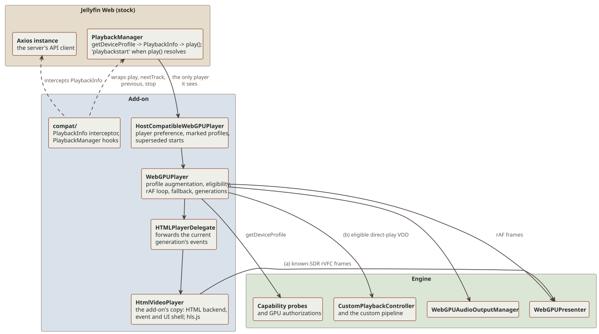
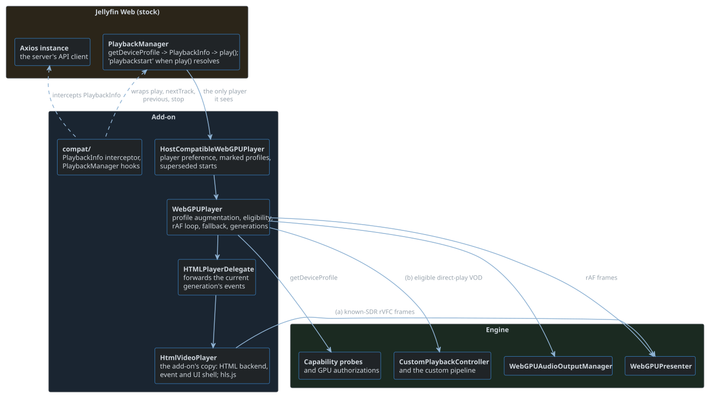

# Playback in Jellyfin Web

This chapter follows the host's half of a playback session.
The engine's [Architecture](../../jellyfin-webgpu-client/vendor/webgpu-player/docs/book/architecture.html) chapter follows the custom pipeline below it.

## Layers

`WebGPUPlayer`, `HTMLPlayerDelegate`, and `HtmlVideoPlayer` with its hls.js runtime are add-on code, and the rAF loop runs in `WebGPUPlayer`.
The engine's [Architecture](../../jellyfin-webgpu-client/vendor/webgpu-player/docs/book/architecture.html#layers) chapter details its side of the diagram.

## Startup of a custom session

1. `WebGPUPlayer.play` advances the presentation generation and consumes the stock-profile proof.
   It runs `prewarmBrowserAudioContext(48000)` (engine) synchronously inside `play()` (the user-activation window), calls `presenter.startSession`, and queues `startBackendPlayback`.
2. `startCustomPlaybackBounded` runs the engine's eligibility check, described in [Negotiation](negotiation.md#flow).
   It waits for the raw SDR prewarm.
   An HDR range-extension source also waits for the raw HDR prewarm, and a Dolby Vision source waits for its first-use key (Profile 4, or Profile 7 or single-layer reconstruction outside I420P10).
   Other HDR and Dolby Vision routes use only keys that have already settled.
   Its 25 s bound lasts until the controller starts, and the controller's own startup bound applies after that.
3. The add-on loads the engine pipeline as the `webgpu-custom-playback` chunk.
   `HtmlVideoPlayer.prepareCustomPlayback` returns a source-less `<video>`.
   The presenter enters push mode, and `configurePresentationColorPipeline` installs the shaders and authorizes the selected route.
4. The engine's controller starts the session; see its [Architecture](../../jellyfin-webgpu-client/vendor/webgpu-player/docs/book/architecture.html#startup-of-a-custom-session) chapter.
5. When the controller emits `ready` and `playing`, the rAF loop starts, `play()` resolves, and PlaybackManager emits `playbackstart`.

## Steady state

- The rAF loop in `WebGPUPlayer` takes the controller's current frame and presents it.
- `WebGPUPlayer` gives the controller a renderer provider, so each decode worker can draw its frames in a canvas the presenter hands it (see the engine's [Embedding](../../jellyfin-webgpu-client/vendor/webgpu-player/docs/book/embedding.html#presentation-in-the-worker) chapter).
  It acknowledges a `'worker-frame'` as it does a `'video-frame'`, once the frame's GPU work completed.
- No rAF runs while the page is hidden, so a 25 ms timer in `WebGPUPlayer` takes and discards due frames against the clock.
  Credits keep flowing and audio stays the master.
- `WebGPUPlayer.selectDecodedAudioOutputChannelCount` returns 2 when the user forces stereo, and otherwise defers to the engine's `selectCustomAudioOutputChannelCountForMaximum`.
- The add-on triggers a live audio layout switch when the output reports `sinkchange` with a different channel count, and when force stereo or the downmix algorithm changes.
- Re-detect output, in the WebGPU settings, rebuilds every AudioContext sink so the browser re-reads the device.
  Chromium moves a default output to a new device without telling the page, which leaves a stale channel count until a rebuild.

## Transitions

- Seek: a new presentation generation, then `controller.seek`.
  Stale results are dropped by `customPlaybackSeekRevision`.
- Audio track switch: eligibility runs again.
  If the source is no longer eligible, the session renegotiates; otherwise it restarts as a seek at the current time.
- Stop: the delegate stops the backend synchronously, so `stopped` stays in order.

## Fallback and renegotiation

The engine's `getFallbackDisposition` decides whether a failure falls back to the HTML player in the same session or renegotiates the source.

- When `currentPlaybackRequiresSourceRenegotiation` is set, every reason renegotiates, because the stock profile does not cover the source.
- Failures in the wrapper itself (presenter, frame submission, rAF) are `lifecycle-failed`.
- Renegotiation fires `sourcerenegotiationrequired` once per session.
  A listener accepts it only by calling `accept()` synchronously during dispatch.
  Stock Jellyfin Web has no listener, so the player raises `PlayerEvent.Error` instead and PlaybackManager's error retry ladder asks for a transcode.
  During a start, `play()` resolves first and the error follows.
- Fallback never selects another player.

Every stale callback is dropped by a generation or revision check.
On the add-on's side:

- `WebGPUPlayer`: the presentation, backend session, setup, seek, audio selection, frame, and terminal error revisions.
- `HTMLPlayerDelegate`: the forwarding generation.

## Gotchas

- The add-on's `HtmlVideoPlayer.play()` runs synchronously only when custom decode is off and no teardown is pending.
  Otherwise it runs after the asynchronous eligibility check.
